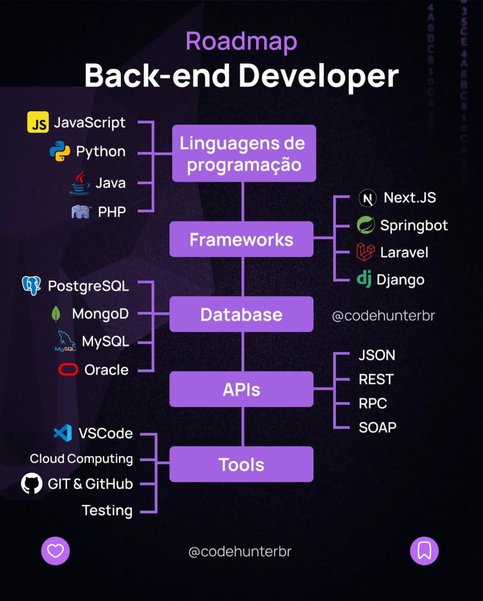

# Hi, I'm Bo! 🌑
🧠🧪 Expanding knowledge on the AI landscape  
🤖 Busy with AI agents orchestration  
🌐 Web developer by night, Lead Engineer by day  
🔭 Looking for beautiful startup ideas for a better future  
💾 Copy-pasting code since 2014 (building on top of great tech)  

✨ build what’s needed, not what’s wanted; so I ended up speaking multiple dev dialects.  
It's a personal preference that works for me, different individuals, different path  
> “Jack of all trades, master of none — oftentimes better than master of one.”

Need mentorship?  
maybe [this](https://github.com/mtdvio/every-programmer-should-know) is what you need  
[this](https://github.com/dreamingechoes/awesome-mental-health) if stressed  
need inspiration? check [these](https://github.com/boazcstrike?tab=stars) out

# 💻 Tech Stack:
               [Django](https://img.shields.io/badge/django-%23092E20.svg?style=for-the-badge&logo=django&logoColor=white)                                                               

# 📊 GitHub Stats
(there's two of em just in case one of them doesn't work)  

 
 

### ✍️ Random Dev Quote

---

###### extra ref
                                    
<!-- Proudly created with GPRM ( https://gprm.itsvg.in ) -->

## 📂 More Notes (indefinite progress)
- [GitHub Repos](github-repos.md)
- [Dev Notes](dev.md)
- [Books to Read](books.md)
- 
### Quick Links
- [(raw)prompt-optimizer-instructions](https://raw.githubusercontent.com/boazcstrike/opencode/refs/heads/main/command/prompt-engineering/prompt-optimizer.md)

## Useful Tools

- [[IT-TOOLS]](https://it-tools.tech/)
- [[COLORS]](https://coolors.co/)

### Milestone Targets

